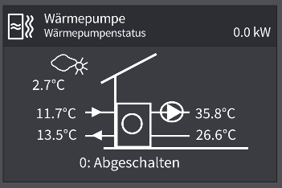

# Wärmepumpenwidget

 
Basis für das Widget war die Anzeige an einer Ochsner Wärmepumpe. 
Das Beispiel wurde von "mumpf" (Waldemar) und "RoyalTS" (Thorsten) erstellt.

# Installation
Einfach kompletten Ordner unter 

> /data/callidomus/local/visu/widgets 

kopieren.
Und in der Konsole folgendes ausführen:

> callidomus.gui build

Danach Widget in der Visualisierung einfügen.

Parameter:
* 'Status' : Item des Status-Textes der Heizung (z.B. WP.Heizung.Statustext - "0: Ausgeschalten" oder "1: Normal Heizbetrieb")
* 'Quelle - Vorlauf' : Temperatur des Vorlaufs zur WP-Quelle in °C
* 'Quelle - Rücklauf' : Temperatur des Rücklaufs von der WP-Quelle in °C
* 'Außentemperatur' : Außentemperatur in °C
* 'Vorlauf der WP' : Temperatur des Wärmepumpen Vorlaufs in °C
* 'Rücklauf der WP' : Temperatur des Wärmepumpen Rücklaufs in °C
* 'Status Kopfzeile' : Der Wert dieses Items wird in der Kopfzeile ausgegeben (z.B. Heizleistung)

